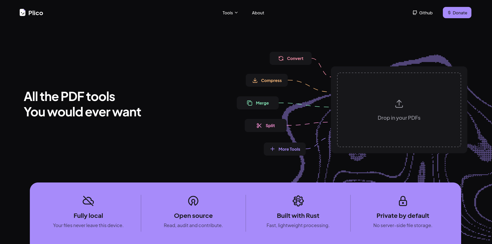

<div align="center">
  <h1>Plico</h1>
  <p><strong>PDF tools that run locally.</strong></p>

  <p>
    
    
    
  </p>
</div>



Plico is an open-source, local-first PDF tool for merging, splitting, compressing,
reordering, and converting documents. Every file is processed in your browser by a Rust
engine compiled to WebAssembly with no server side processing 

## Run it locally

You need Node.js, Rust with the Wasm target, and `wasm-pack`:

```sh
rustup target add wasm32-unknown-unknown
brew install wasm-pack
npm install
npm run dev
```

The generated Wasm package is not committed. `npm run dev`, `npm run build`, and
`npm run check` build it automatically

## Useful commands

```sh
npm run check        # Svelte and TypeScript checks
npm run build        # production build
npm run test:engine  # Rust engine tests
npm run test:corpus  # structural checks against a local PDF corpus
```
